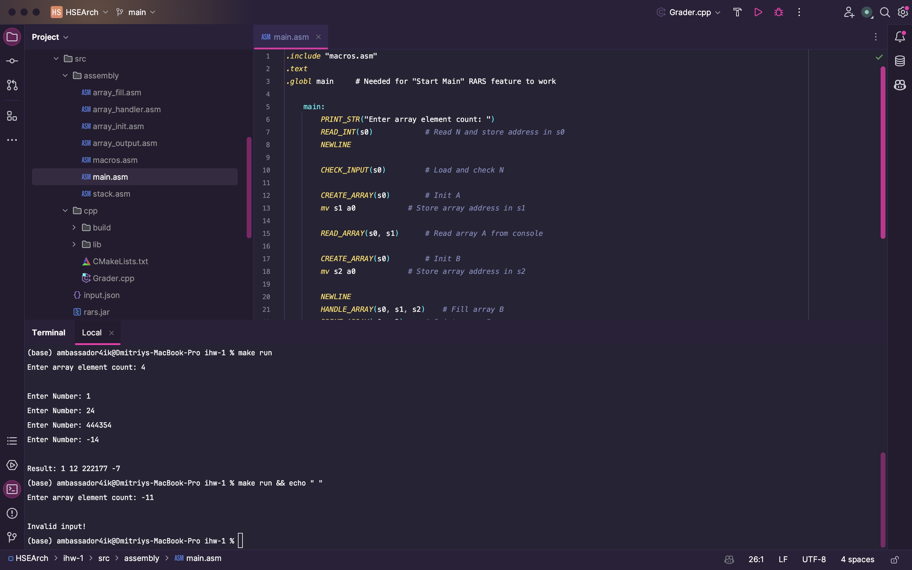
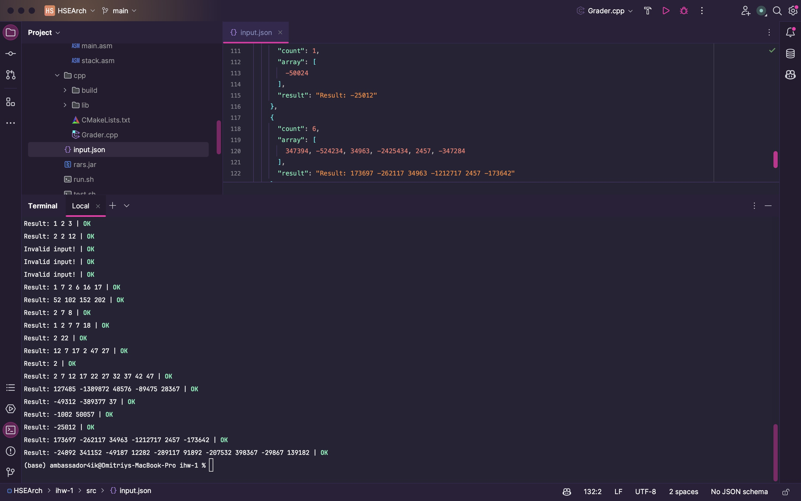

# ИДЗ #1
## Целочисленная арифметика. Одномерные массивы

### Задание
**Вариант 27.** Сформировать массив B из элементов массива A. Элементы массива, оканчивающиеся цифрой 4, уменьшить вдвое.\
**Выполнил:** Игнатенко Дмитрий Александрович БПИ226\
Работа на 10 (очень надеюсь).

### Архитектура
Примерная архитектура приложения изображена ниже. Стрелками одного цвета обозначены вызовы подпрограмм, над стрелками указаны передаваемые параметры. 


### Ассемблер-код
Основной код программы находится в папке [assembly](src/assembly), основной файл - [main.asm](src/assembly/main.asm).\
Коротко про другие файлы:
#### [macros.asm](src/assembly/macros.asm)
Содержит макроопределения, используемые в программе.\
Вместе с файлами ввода, вывода, макросов стека и обработки массива составляет автономную библиотеку, которую можно использовать в других программах.
#### [stack.asm](src/assembly/stack.asm)
Макросы для работы со стеком.\
Продублированы отдельно от [macros.asm](src/assembly/macros.asm) для удобства использования в других подпрограммах и избежания множественного включения.
#### [array_init.asm](src/assembly/array_init.asm)
Содержит подпрограмму инициализации массива.\
Принимает на вход размерность массива, динамически выделяет память под него в куче, возвращает адрес начала массива. Здесь и далее более подробная информация есть в комментариях в файле.
#### [array_fill.asm](src/assembly/array_fill.asm) 
Содержит подпрограмму заполнения массива.\
Принимает на вход адрес начала массива и его размерность. Заполняет массив числами с клавиатуры. 
#### [array_handler.asm](src/assembly/array_handler.asm)
Содержит подпрограмму обработки массива.\
Выполняет задачу, поставленную в варианте. Принимает на вход размерность массива, адреса начала массива `A` и массива `B`.
Массив `B` создается в основной программе и передается в подпрограмму.
#### [array_output.asm](src/assembly/array_output.asm)
Содержит подпрограмму вывода массива.\
Принимает на вход размерность массива и адрес начала массива. Выводит массив на экран.

#### Немного обо всем
Подпрограммы используют локальные переменные и сохраняют значения `s`-регистров на стеке. Для возврата значений используется регистр `a0`, для передачи параметров - регистры `a1-a3`.\
Количество элементов массива хранится в регистре `s0`, адреса массивов `A` и `B` - в регистрах `s1` и `s2` соответственно.\
Передача параметров описана непосредственно в подпрограммах, потому что это логичнее, чем писать их в макросах или у вызовов макросов.

### Ручные тесты
Благодаря поддержке эмулятором RARS работы в console-only режиме, можно запускать программу без GUI. Для этого выполните следующую команду:
```shell
make run
```
Если у вас не установлен `make`, вы можете запустить программу напрямую:
```shell
java -jar ./src/rars.jar sm nc p ./src/assembly/main.asm
```
При возникновении ошибок, убедитесь, что вы находитесь в корневой папке проекта.\
Пример работы программы с ручным вводом:



Программу также можно запустить в Docker-контейнере, для этого выполните команду:
```shell
make run-docker
```
При возникновении ошибок, убедитесь, что у вас установлен `docker` и `docker-compose`.\
Если у вас отсутствует `make`, команды для запуска вы можете найти в [Makefile](Makefile).

Программа все так же будет работать, если просто запустить ее в эмуляторе RARS, если конечно вам угодно вручную поочередно открывать 7 файлов...

### Автоматические тесты
Для автоматизации тестирования была написана программа на `С++`.\
Программа и библиотеки к ней находятся в папке [cpp](src/cpp).\
Система весьма универсальна и сейчас подходит для тестирования любых программ, в которых производится поэлементный ввод, а затем вывод одномерного массива. После небольших изменений будет возможно тестирования практически любого ассемблер-кода.\
Файл с тестами - [input.json](src/input.json). Формат входных данных тривиален, вы можете посмотреть пример в файле.\

Для запуска автоматического тестирования используйте следующую команду:
```shell
make test
```

Рекомендуется использовать Docker-контейнер, так как в нем программа гарантированно работает.\
Для запуска автоматического тестирования в Docker-контейнере используйте следующую команду:
```shell
make test-docker
```

Пример работы программы с автоматическим вводом:



### Примечания
* Работа программы была проверена только на Mac OS 14 и Ubuntu 22.04, при использовании не-Unix систем рекомендуется использовать Docker, поскольку программа использует `shell`. В теории, все должно заводится и на Windows, но возможности проверить у меня не было.
* Для очистки проекта используйте команду `make clean`.
* У меня не получилось толком разбить отчет на разные количества баллов, тут слишком много всего оказалось...

